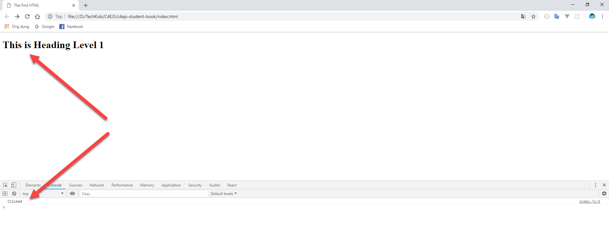
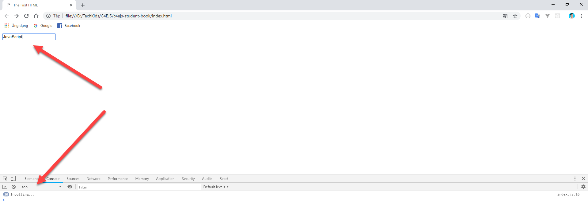
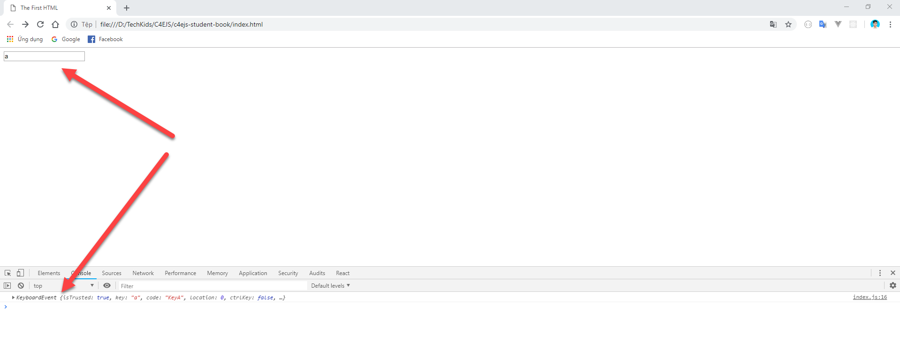

## C4E JS - Student book

### IV. EVENTS
-   Sự tương tác của người dùng đối với trang web bao gồm các hành động đến từ bàn phím và chuột, ví dụ như click chuột, di chuột, gõ phím, ...

-   Tất cả những hành động như vậy được gọi là **Events**.

-   Có rất rất nhiều **event** trong JS, trong chương này chúng ta sẽ cùng nhau tìm hiểu một vài event cơ bản, các loại event khác sẽ có cách sử dụng tương tự. Ở cuối chương sẽ có danh sách tất cả các events kèm mô tả chi tiết để bạn có thể áp dụng tùy vào từng tình huống cụ thể.

**1. Mouse**
-   Chúng ta sẽ tìm hiểu event thường xuyên xảy ra nhất khi người dùng sử dụng chuột, đó là thao tác click chuột.

-   Click là event khi người dùng click chuột vào bất kỳ thẻ HTML nào đó. Cú pháp để bắt được event click chuột như sau:

    -   Ở HTML chúng ta có thẻ h1:
    ```html
        <h1 id="heading-1">This is Heading Level 1</h1>
    ```

    -   Sang file JS, chúng ta tiến hành chọn lấy thẻ h1:
    ```js
        let h1 = document.getElementById('heading-1');
    ```

    -   Thực hiện bắt event khi người dùng click vào thẻ h1, cú pháp mới đầu khi làm quen tương đối khó viết, nhưng sau một vài lần bạn sẽ quen:
    ```js
        h1.addEventListener('click', function(){
            console.log("Clicked");
        })
    ```

    -   Ở cú pháp trên, chúng ta sử dụng chức năng **addEventListener** để "lắng nghe" event người dùng đang thực hiện. Bên trong **addEventListener** có 2 parameter:
        -   `'click'`: tên của event người dùng thực hiện
        -   Tiếp đó sẽ là **một function**, bên trong function đó chứa những đoạn code mà bạn muốn thực hiện sau khi người dùng click vào thẻ h1.
    
    -   Chạy đoạn code trên, sau đó thử click vào thẻ h1, chúng ta có kết quả như sau:

     

-   Ngoài click ra, người dùng khi sử dụng chuột sẽ có rất nhiều các thao tác khác như di chuột vào thẻ (mouseenter), di chuột ra ngoài thẻ (mouseleave), click đúp vào thẻ (dblclick),... bạn chỉ cần thay từ khóa vào parameter đầu tiên của **addEventListener**. Bạn hãy kéo xuống cuối chương để xem danh sách đầy đủ các event nhé.

**Bài tập**
-   Tìm hiểu thẻ button.

-   Tạo ra một nút bấm với nội dung là "Click to add new player".

-   Dựa vào thẻ ul, li, tạo ra danh sách tên các cầu thủ Ronaldo, Messi, Neymar.

-   Sau khi click vào button "Click to add new player", thêm vào trong danh sách cầu thủ Kante.

**2. Keyboard**
-   Trong phần này chúng ta sẽ tìm hiểu event thường xuyên xảy ra nhất khi người dùng sử dụng bàn phím, đó là thao tác bấm phím.

-   Ở HTML, chúng ta có 1 thẻ input như sau:
    ```html
       <input id="my-input" type="text">  
    ```
-   Thẻ input là một thẻ không có thẻ đóng. Trong thẻ input trên có 1 attribute mới là `type`, với value là `text`. Attribute này có tác dụng báo với trình duyệt đây là một thẻ cho người dùng nhập text từ bàn phím. Sau khi tạo ra thẻ input, chúng ta được một ô input như sau:

     

-   Sang file JS, chọn lấy thẻ input:
    ```js
        let myInput = document.getElementById('my-input');
    ```

-   Thực hiện bắt event khi người dùng nhập vào ô input:
    ```js
        myInput.addEventListener('keypress', function(){
            console.log("Inputting...");
        })
    ```

-   Cú pháp tương tự như khi chúng ta thực hiện bắt event click, chỉ khác ở parameter đầu tiên của **addEventListener**, ở đây chúng ta sử dụng `keypress`. 

-   Reload lại trang web và bạn hãy thử nhập vào ô input rồi quan sát dưới màn hình console, kết quả như sau:

     

-   Như vậy là mỗi lần gõ 1 phím, câu `Inputting...` sẽ được in ra màn hình một lần.

-   Làm sao để biết được cụ thể người dùng bấm phím nào?Parameter thứ 2 của **addEventListener** là một function. Quan sát function này bạn sẽ thấy nó chưa hề có parameter, chúng ta đã để trống từ đầu đến giờ. Bây giờ hãy thử đặt vào đó một cái tên bất kỳ, rồi in ra màn hình thử xem chương trình có báo lỗi không, bạn đừng quên gõ phím nhé.

    ```js
        myInput.addEventListener('keypress', function(data){
            console.log(data);
        })
    ```

-   Kết quả như sau:

     

-   Trong ảnh trên, khi phím "a" được gõ, thì ngay lập tức dưới màn hình console hiện ra một object, chứa đầy đủ thông tin liên quan đến phím "a" mà người dùng vừa gõ. Bạn hãy mở object này ra để tìm kiếm property thích hợp nhé.

&rarr; Như vậy có thể thấy, parameter `data` trong đoạn code ví dụ trên đã giúp chúng ta nhiều hơn mong đợi, nó cho chúng ta biết được rất nhiều thông tin xung quanh 1 phím bấm. Nhờ có nó mà chúng ta có thể dễ dàng biết được người dùng vừa bấm phím nào.

**Bài tập**
-   Tạo ra danh sách tên các cầu thủ Ronaldo, Messi, Neymar.

-   Tạo ra một ô input để nhập tên cầu thủ từ bàn phím.

-   Sau khi người dùng nhập tên cầu thủ và bấm phím Enter thì tiến hành thêm cầu thủ mà người dùng vừa nhập vào danh sách các cầu thủ ban đầu.

*Gợi ý*:
-   Đừng quên rằng khi đã chọn được thẻ input thì bạn có thể xem được toàn bộ property của thẻ input đó. Trong đó sẽ có property cho biết nội dung của thẻ input.


***Tham khảo***:

Bạn có thể xem toàn bộ các events mà JavaScript hỗ trợ tại [W3School](https://www.w3schools.com/jsref/dom_obj_event.asp).

*Bài tiếp theo [Networking](../networking/networking.md)*