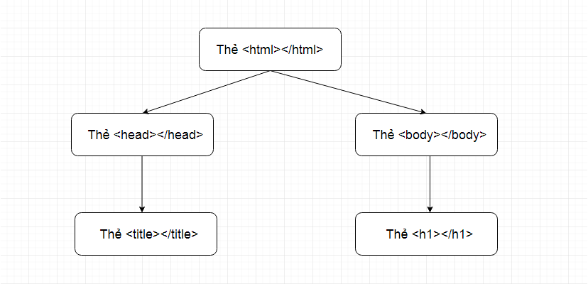
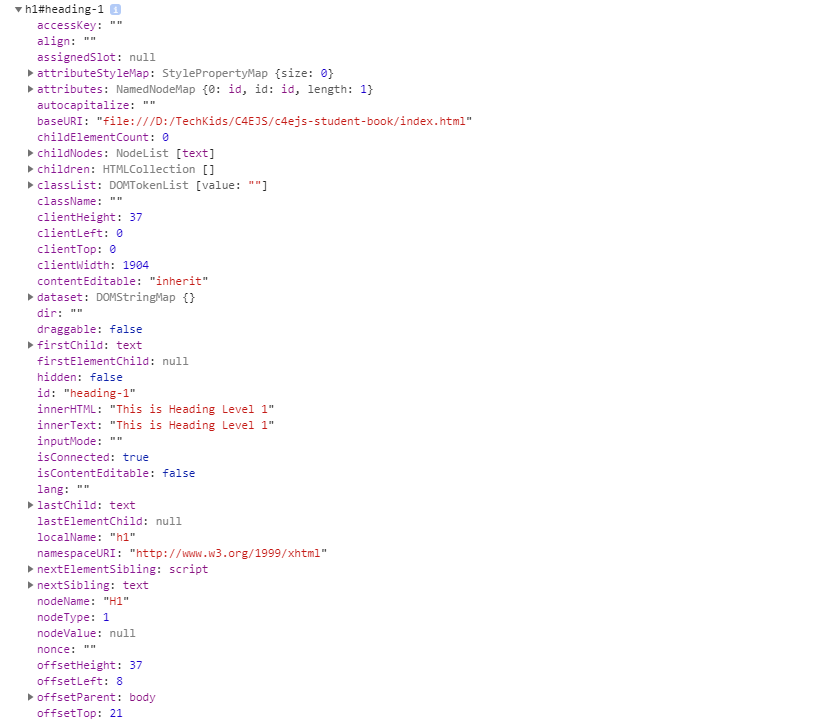

## C4E JS - Student book

### I. DOM LÀ GÌ?

**1. Giới thiệu**
-   Từ đầu khóa học đến giờ, chúng ta học JavaScript và thực hành chủ yếu dựa trên màn hình console (inspect).

-   Sau khi học qua hết 1 lượt các khái niệm cơ bản trong JS, chúng ta chuyển qua học HTML và hiển thị được một vài nội dung trên trang web.

&rarr; JS tác động đến trang web, hay cụ thể là HTML như thế nào? **DOM** được sinh ra để giúp JS làm điều này.

**2. Khái niệm**
-   **DOM** là viết tắt của **D**ocument **O**bject **M**odel.

-   Nhờ có **DOM**, JavaScript có thể truy cập vào các thẻ HTML và thay đổi chúng.

-   Giả sử chúng ta có một đoạn HTML như sau:
    ``` html
        <!DOCTYPE html>
        <html lang="en">
            <head>
                <title>The First HTML</title>
            </head>
            <body>
                <h1>This is Heading Level 1</h1>
            </body>
        </html>
    ```


-   Khi xử lý đoạn HTML trên, trình duyệt sẽ dựng đoạn code trên thành một cấu trúc dạng cây như sau:

     

-   Cấu trúc dạng cây này được gọi là **DOM Tree**. Mỗi một thành phần trong **DOM Tree** được gọi là một **Node**. 

### II. DOM GET ELEMENT

Chúng ta sẽ học cách lấy ra một hoặc nhiều thẻ HTML để làm việc với chúng.

Có 3 cách để lấy ra một thẻ HTML:

**1. Get by id**:
-   Cách này thường được sử dụng để lấy ra một thẻ HTML duy nhất, dựa vào **id của thẻ**.

-   **id của thẻ** là một **attribute** của thẻ đó, chúng ta thêm **attribute id** và đặt tên id cho thẻ muốn lấy như sau (đã là id thì nên là duy nhất trong cả trang web):
    ```html
        <h1 id="heading-1">This is Heading Level 1</h1>
    ```

-   Chúng ta đặt cho `thẻ h1` một `id` tên là `heading-1`. Sau đó sang file JavaScript, tiến hành chọn thẻ dựa vào id như sau:
    ```javascript
        let h1 = document.getElementById('heading-1');

        console.log(h1);
    ```

-   Ở đoạn code trên, một biến h1 được tạo ra để chứa thẻ mà chúng ta đã chọn.

-   `document.getElementById()` là chức năng có sẵn của JavaScript, công việc của bạn chỉ là điền tên id đã đặt cho thẻ vào bên trong cặp ngoặc đơn.

-   Sau đó in ra màn hình thẻ h1, kết quả như sau:

     

-   Bạn cũng có thể bóc từng phần nhỏ của thẻ ra rồi in ra màn hình như sau:

    ```javascript
        console.log(h1.innerHTML); // Lấy ra phần text của thẻ

        console.log(h1.id); // Lấy ra id của thẻ
    ```

     

    &rarr; Vậy những thứ như `innerHTML` và `id` lấy ở đâu ra? Và làm sao để biết được trong thẻ h1 này có chứa những thông tin gì?

    &rarr; Bạn hãy sửa `console.log(h1)` thành `console.dir(h1)`. Kết quả như sau:

     

-   Bạn hãy mở thẻ h1 ra để xem bên trong nó có những property nào, mang value là gì. `innerHTML` và `id` cũng được lấy từ đây ra. Tùy vào từng tình huống cụ thể trong quá trình phát triển web mà bạn có thể lựa chọn lấy ra cho mình như property phù hợp.

**2. Get by ClassName**

-   Cách này thường được sử dụng để lấy ra một nhóm thẻ HTML, dựa vào **class của thẻ**.

-   Tương tự như id, **class của thẻ** là một **attribute** của thẻ đó, chúng ta thêm **attribute class** và đặt tên class cho thẻ.

-   Chính vì cách này thường được sử dụng để lấy ra một nhóm các thẻ HTML, vì vậy nên các thẻ khác nhau có thể mang cùng một tên class giống nhau:

    ```html
        <h1 class="heading">This is Heading Level 1</h1>
        <h2 class="heading">This is Heading Level 2</h2>
    ```

-   Chúng ta đặt cho `thẻ h1` và `thẻ h2` mỗi thẻ một **attribute class**, và đặt cho chúng cùng một tên là `heading`. Sau đó sang file JavaScript, tiến hành chọn thẻ dựa vào class như sau:
    ```javascript
        let headingTags = document.getElementsByClassName('heading');

        console.log(headingTags);
    ```

-   Tương tự như cách lấy thẻ dựa vào id, `document.getElementsByClassName()` cũng là chức năng có sẵn của JavaScript, bên trong cặp ngoặc đơn sẽ là tên class.

-   Sau khi lấy được nhóm thẻ ra rồi thì bạn có thể thực hiện các thao tác tiếp theo giống như khi bạn đã lấy được thẻ dựa vào id.

**3. Get by Tag Name**
-   Cách này lấy ra một hoặc một nhóm thẻ HTML dựa vào **tên của thẻ**. Cách này ít được sử dụng, vì tên thẻ không thể tùy ý đặt tên, hơn nữa một loại thẻ có thể được sử dụng ở rất nhiều chỗ trên cùng 1 trang web. Nên người phát triển web sẽ thường phân biệt các thẻ hoặc các nhóm thẻ bằng id và class hơn.

-   Cú pháp và các thao tác y hệt như cách lấy ra một hoặc nhiều thẻ HTML thông qua id hoặc class. Bạn chỉ cần thay đổi `document.getElementsByClassName()` thành `document.getElementsByTagName()`, bên trong cặp ngoặc đơn là tên của thẻ.
    
### III. MANIPULATING DOM ELEMENTS
**Manipulating** có thể hiểu đơn giản là thực hiện một vài thao tác cơ bản sau khi đã lấy được thẻ.

**1. Thay đổi nội dung của thẻ**
-   Chúng ta sẽ thử thay đổi nội dung của 1 thẻ html có sẵn, thông qua id của thẻ đó

-   Ở file html, chúng ta có thẻ h1 như sau:
    ```html
        <h1 id="heading-1">This is Heading Level 1</h1>
    ```

-   Thẻ h1 đang có nội dung là `This is Heading Level 1` và id là `heading-1`

-   Chuyển qua file js, việc đầu tiên chúng ta cần làm chính là lấy ra được thẻ h1:

    ```javascript
        let h1 = document.getElementById('heading-1');
    ```

-   Sau đó gọi ra **property** `innerHTML` của h1, và gán cho nó một giá trị mới:

    ```javascript
        let h1 = document.getElementById('heading-1');
        h1.innerHTML = "Hello, my name is HEADING LEVEL 1";
    ```
-   Reload lại trang web, bạn sẽ thấy nội dung của thẻ h1 hiển thị trên web khác hoàn toàn so với lúc tạo ra thẻ h1:

     

***Nhận xét:*** Khi đã lấy được ra một thẻ html ở javascript rồi thì bạn có thể tùy ý thay đổi bất cứ thứ gì của thẻ đó, tùy thuộc vào property mà bạn gọi ra.

***Bài tập***
-   Hãy tạo ra một thẻ a, với đường dẫn đến trang Google.
-   Tiến hành thay đổi đường dẫn của thẻ a dẫn đến trang Facebook bằng JS.

**2. Thêm một thẻ mới**
-   Chúng ta sẽ thử thêm 1 thẻ html vào file html mà không cần phải tạo ra nó từ trước ở file html. Cụ thể ở ví dụ này chúng ta sẽ thêm một `thẻ h2` vào trong `thẻ body`, sau khi thêm thì `thẻ h2` sẽ nằm cùng bậc với `thẻ h1`.

-   Đặt cho `thẻ body` một **id** tên là `nice-body`, bên trong đang có 1 thẻ h1:

    ```html
        <body id="nice-body">
            <h1 id="heading-1" class="1">This is Heading Level 1</h1>
        </body>
    ``` 

-   Lấy ra thẻ body dựa vào id:
    ```javascript
        let body = document.getElementById('nice-body');
    ```

-   Tạo ra biến h2 để chứa nội dung mà bạn muốn thêm vào thẻ body:

    ```javascript
        let h2 = `<h2>This is heading level 2</h2>`;
    ```
-   Thực hiện thêm thẻ h2 vừa tạo ra vào body theo cú pháp sau:
    ```js
        body.innerHTML += h2;     
    ```
-   Ở câu lệnh trên, chúng ta đang thực hiện lấy ra `innerHTML` của thẻ body và cộng thêm thẻ h2 vào thông qua toán tử `+=`.

-   Reload lại trang web, bạn sẽ thấy thẻ h2 đã xuất hiện, mặc dù chúng ta không hề tạo ra nó từ đầu ở file html:

     

***Bài tập***
-   Tìm hiểu về thẻ ul và thẻ li trong HTML.
-   Tiến hành thêm vào trang web danh sách tên các cầu thủ Ronaldo, Messi, Neymar.

**3. Xóa một thẻ đã có**
-   Ở file html, chúng ta có hai thẻ h1 và h2 với các id tương ứng như sau:
    ```html
        <h1 id="heading-1">This is Heading Level 1</h1>
        <h2 id="heading-2">This is heading level 2</h2>
    ``` 

-   Chúng ta sẽ thử xóa đi thẻ h2, mà không cần phải động vào file html.

-   Lấy ra thẻ h2 dựa vào id:
    ```javascript
        let h2 = document.getElementById('heading-2');
    ```

-   Việc tiếp theo chúng ta cần làm chỉ đơn giản là sử dụng chức năng có sẵn của JS như sau:

    ```js
        h2.remove();
    ```
-   Với **function remove** đã có sẵn của JS, thẻ h2 đã bị xóa mà không cần phải xóa trực tiếp trong file html:

     

***Bài tập***
-   Tiến hành xóa đi tên của cầu thủ Neymar trong danh sách các cầu thủ đã hiển thị ở phần 2.

***Tổng kết:***

Nếu để ý bạn sẽ thấy tất cả những thao tác tác động lên các thẻ HTML xảy ra ngay khi vừa reload lại trang web. Vậy tại sao không chỉnh sửa trực tiếp ngay ở file HTML, mà lại phải tốn công viết thêm code ở JavaScript?

&rarr; Trên thực tế, người lập trình không thể biết được khi nào thì những thẻ nội dung trong file HTML cần được thay đổi. Lý do là vì những sự thay đổi đó sẽ phụ thuộc vào từng hành động của người dùng. 

&rarr; Trong phần sau, chúng ta sẽ đi tìm hiểu cách nắm bắt từng hành động cụ thể của người dùng, dựa vào đó để có thể tùy chỉnh các thẻ HTML cho từng tình huống một cách phù hợp.


*Bài tiếp theo [DOM Events](dom-events.md)*

